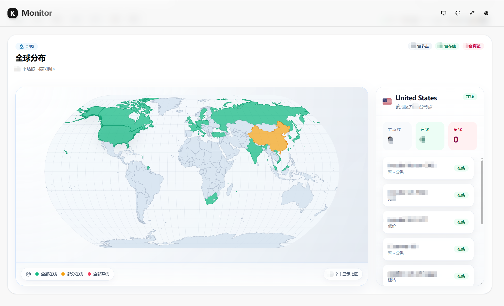
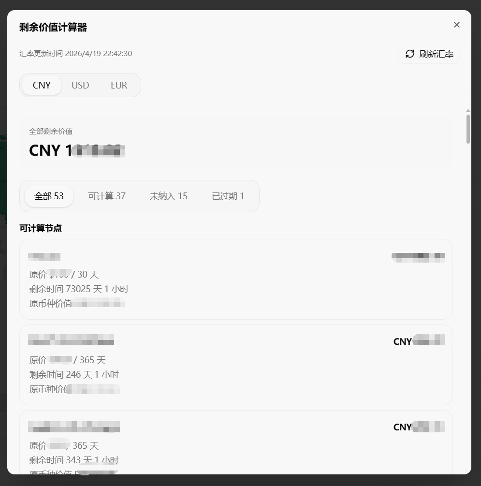
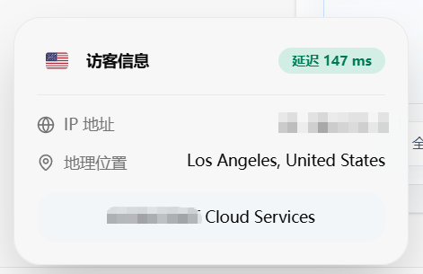

# Komari Nexus

Komari Nexus 是一个基于 [KomariNext](https://github.com/tonyliuzj/komari-next) 深度定制的 Komari 主题，重点增强了全球展示能力和页面侧实用功能。

[仓库地址](https://github.com/piphase/komari-nexus)

## 项目说明

Komari Nexus 保留了 KomariNext 原本成熟的主题基础，但在此之上更强调两件事：

- 更直观的全球节点分布展示
- 更实用的主题内辅助功能

如果你希望主题不仅能展示节点状态，还能直接提供地图分布、剩余价值统计、访客信息这类增强能力，那么 Komari Nexus 更适合作为一个独立项目来使用。

## 基于 KomariNext

Komari Nexus 是基于 [KomariNext](https://github.com/tonyliuzj/komari-next) 进行的二次开发项目。

原项目提供了 Komari 主题的基础能力和整体技术框架，本项目在此基础上做了定向增强与界面重构。README 会明确保留上游项目链接与致谢说明，不会抹去原始来源。

## Komari Nexus 新增功能

### 全球分布模块

Komari Nexus 新增了一个专门的全球分布视图，用来更直观地查看节点的地理分布情况。

主要包括：

- 基于世界地图的节点分布展示
- 国家 / 地区高亮
- 右侧联动显示该地区的节点列表
- 可继续打开现有的节点详情抽屉



### 剩余价值计算器

Komari Nexus 新增了一个剩余价值计算器，用来统计带有价格与周期信息的节点剩余价值。

主要包括：

- 右下角浮动入口
- 页面统计区入口按钮
- 基于价格、周期、到期时间的剩余价值计算
- 默认按 CNY 展示并支持汇率换算
- 支持区分可计算、未纳入、已过期节点



### 访客信息浮动卡片

Komari Nexus 新增了一个左下角访客信息浮动卡片，用来显示访客侧的基础网络与地理信息。

主要包括：

- IP 地址展示
- 地理位置与网络信息展示
- 等待数据准备完成后再弹出
- 展示数秒后自动收起
- 收起后可通过小按钮重新展开



## 原项目功能

对于 KomariNext 原本已经具备的基础主题能力、原始功能范围和上游说明，请直接参考原项目仓库：

[KomariNext](https://github.com/tonyliuzj/komari-next)

本 README 不再重复罗列所有继承能力，而是重点说明 Komari Nexus 自身新增和调整过的部分。

## 使用方式

推荐使用方式：

1. 在 Releases 中下载打包好的主题文件
2. 在 Komari 后台上传主题包并启用

如果你需要本地开发或自行打包，也可以按下面的方式构建。

## 开发

安装依赖：

```bash
npm install
```

启动开发环境：

```bash
npm run dev
```

构建主题静态输出：

```bash
npm run build
```

打包 Komari 主题时请确保：

- zip 根目录包含 `komari-theme.json`
- zip 根目录包含 `preview.png`
- 页面构建内容位于 `dist/` 目录下

## 致谢与许可证

Komari Nexus 是一个独立维护的主题项目，但它建立在 [KomariNext](https://github.com/tonyliuzj/komari-next) 的基础之上。

在分发、修改或继续二次开发时，请保留对上游项目的致谢与许可证信息。
